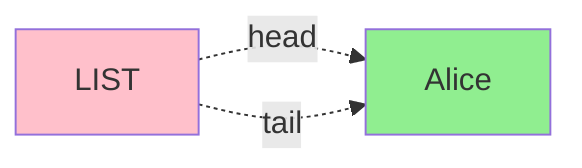
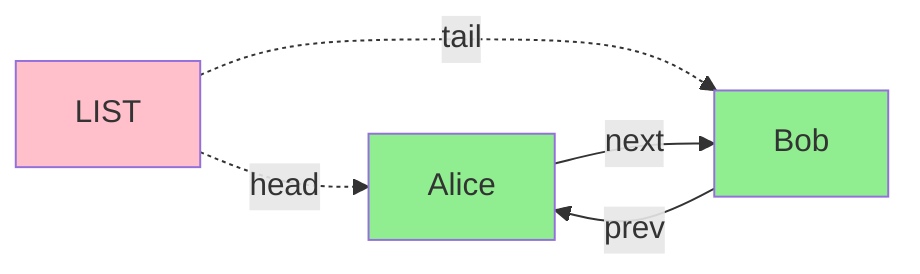
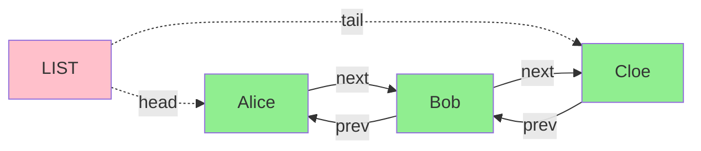
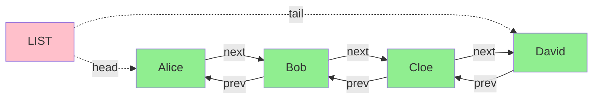

# codebar-java-data-structures

## Empty list

* head == tail
* head == null
* tail == null

## List with 1 element

* head == tail
* head != null
* tail != null

## List with 2 elements

* head != tail
* head != null
* tail != null

## List with 3 elements

* head != tail
* head != null
* tail != null

## List with 4 elements

* head != tail
* head != null
* tail != null
